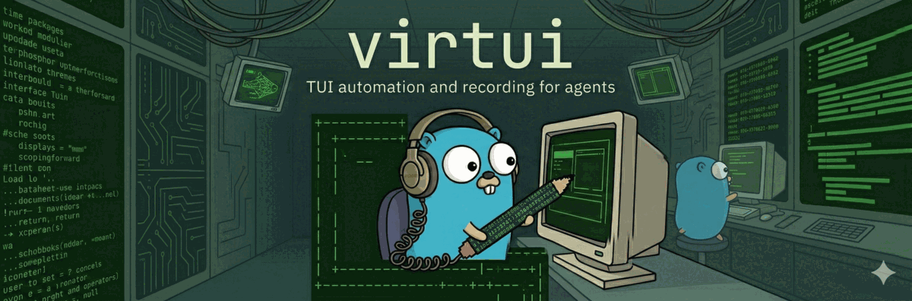

<p align="center">
  
</p>

# virtui

TUI automation for AI agents. A daemon + CLI that lets AI agents programmatically
drive terminal applications via a gRPC API over Unix domain sockets.

> "It's like Playwright, for TUI apps"

## Use Cases

- **Proof of work** — Have agents showcase the feature they built or bug they fixed, and submit recordings alongside their PRs for easy reviews.
- **Tight feedback loops** — Tell agents to USE the TUI to make sure the UI works properly.

## Install Skill

Add the virtui skill to your AI agent:

```bash
npx tessl i honeybadge/virtui
```

```bash
npx skills add honeybadge-labs/virtui
```

Then prompt your agent:

> Use /virtui to create a recording of you opening vim, saving a file named hello.txt and exiting.

## Install

**Homebrew (macOS & Linux):**

```bash
brew install honeybadge-labs/tap/virtui
```

**Go:**

```bash
go install github.com/honeybadge-labs/virtui/cmd/virtui@latest
```

**Binary releases:** download from [GitHub Releases](https://github.com/honeybadge-labs/virtui/releases).

## Quick Start

```bash
# 1. Start the daemon
virtui daemon start

# 2. Launch a terminal session
virtui run bash
# Output: session_id: a1b2c3d4

# 3. Run a command (type + Enter + wait for output)
virtui exec a1b2c3d4 "echo hello" --wait "hello"

# 4. Take a screenshot
virtui screenshot a1b2c3d4

# 5. Clean up
virtui kill a1b2c3d4
pkill -f 'virtui.*daemon.*foreground'   # daemon stop is currently a no-op
```

## JSON Mode

Most commands support `--json` (`-j`) for machine-readable output (exceptions: `daemon start` and `daemon stop` always print plain text):

```bash
virtui --json run bash
# {"session_id":"a1b2c3d4","pid":1234,"recording_path":""}

virtui --json screenshot a1b2c3d4
# {"screen_text":"...","screen_hash":"5da7...","cursor_row":3,"cursor_col":10,"cols":80,"rows":24}
```

> **Note:** Fields backed by proto3 `int64` (`elapsed_ms`, `created_at`) are serialized as
> JSON strings per the [proto3 JSON mapping](https://protobuf.dev/programming-guides/proto3/#json).

## Architecture

```
AI Agent / LLM
     |
CLI (virtui)  or  Go SDK (import "github.com/honeybadge-labs/virtui")
     |
gRPC over Unix domain socket (~/.virtui/daemon.sock)
     |
Daemon (session manager + terminal emulator per session)
     |
PTY (creack/pty) + VT100 emulation (vt10x)
```

The daemon manages multiple terminal sessions. Each session owns a pseudo-terminal
and a VT100 emulator. Every response includes a SHA-256 screen hash for cheap
change detection without transferring screen contents.

## CLI Reference

### Global Flags

| Flag       | Short | Env             | Default                 | Description           |
| ---------- | ----- | --------------- | ----------------------- | --------------------- |
| `--json`   | `-j`  |                 | `false`                 | Output in JSON format |
| `--socket` |       | `VIRTUI_SOCKET` | `~/.virtui/daemon.sock` | Daemon socket path    |

---

### `virtui daemon start`

Start the daemon process.

```bash
virtui daemon start                # background (detached)
virtui daemon start --foreground   # foreground (blocks)
```

| Flag           | Default | Description                                |
| -------------- | ------- | ------------------------------------------ |
| `--foreground` | `false` | Run in the foreground instead of detaching |

### `virtui daemon stop`

> **Known issue:** `daemon stop` currently prints "daemon stopped" but does **not** actually
> terminate the daemon process. To stop the daemon, run
> `pkill -f 'virtui.*daemon.*foreground'` or kill the PID printed by `daemon start`.

```bash
virtui daemon stop
```

### `virtui daemon status`

Check if the daemon is running.

```bash
virtui daemon status
# daemon: running (socket: /Users/you/.virtui/daemon.sock)

virtui --json daemon status
# {"running":true,"socket":"/Users/you/.virtui/daemon.sock"}
```

---

### `virtui run <command...>`

Spawn a new terminal session running the given command.

```bash
virtui run bash
virtui run --cols 120 --rows 40 vim file.txt
virtui run --record bash
virtui run --record --record-path ./demo.cast bash
virtui run -e TERM=dumb -e FOO=bar bash
```

| Flag            | Default | Description                                                       |
| --------------- | ------- | ----------------------------------------------------------------- |
| `--cols`        | `80`    | Terminal columns                                                  |
| `--rows`        | `24`    | Terminal rows                                                     |
| `-e`, `--env`   |         | Environment variables (`KEY=VALUE`), repeatable                   |
| `--dir`         |         | Working directory for the child process                           |
| `--record`      | `false` | Record session in asciicast v2 format                             |
| `--record-path` | auto    | Custom recording path (default: `~/.virtui/recordings/<id>.cast`) |

**Output (JSON):**

```json
{
  "session_id": "a1b2c3d4",
  "pid": 1234,
  "recording_path": "/Users/you/.virtui/recordings/a1b2c3d4.cast"
}
```

---

### `virtui exec <session> <input>`

The primary command for AI interaction. Types the input, presses Enter, and optionally
waits for a screen condition before returning.

> **Caveat:** Wait conditions check the screen immediately after input is sent. If the
> target text already appears (e.g., inside the typed command itself), the wait can resolve
> in 0 ms — before the command's actual output appears. For reliable results use a
> [pipeline](#virtui-pipeline-session) with separate `type` → `press Enter` → `wait` steps,
> or follow `exec` with a standalone `wait` command.

```bash
# Type + Enter (fire and forget)
virtui exec a1b2c3d4 "ls -la"

# Type + Enter + wait for text to appear
virtui exec a1b2c3d4 "npm install" --wait "added"

# Type + Enter + wait for screen to settle (500ms of no changes — does NOT guarantee the process finished)
virtui exec a1b2c3d4 "make build" --wait-stable

# Type + Enter + wait for text to disappear
virtui exec a1b2c3d4 "make" --wait-gone "compiling..."

# Type + Enter + wait for regex match
virtui exec a1b2c3d4 "node --version" --wait-regex "v\d+\.\d+"

# With custom timeout
virtui exec a1b2c3d4 "npm install" --wait "added" --timeout 60000
```

| Argument  | Required | Description                                    |
| --------- | -------- | ---------------------------------------------- |
| `session` | yes      | Session ID                                     |
| `input`   | yes      | Text to type (Enter is appended automatically) |

| Flag            | Default | Description                                        |
| --------------- | ------- | -------------------------------------------------- |
| `--wait`        |         | Wait for this text to appear on screen             |
| `--wait-stable` | `false` | Wait for 500 ms of no screen changes (does **not** guarantee process finished) |
| `--wait-gone`   |         | Wait for this text to disappear from screen        |
| `--wait-regex`  |         | Wait for a regex pattern to match on screen        |
| `--timeout`     | `30000` | Timeout in milliseconds                            |

**Output (JSON):**

```json
{
  "screen_text": "$ ls -la\ntotal 42\n...",
  "screen_hash": "5da7a532...",
  "cursor_row": 10,
  "cursor_col": 2,
  "elapsed_ms": "150"
}
```

---

### `virtui screenshot <session>`

Capture the current terminal screen contents.

```bash
virtui screenshot a1b2c3d4          # plain text to stdout
virtui --json screenshot a1b2c3d4   # structured JSON with hash
```

| Argument  | Required | Description |
| --------- | -------- | ----------- |
| `session` | yes      | Session ID  |

**Output (JSON):**

```json
{
  "screen_text": "$ echo hello\nhello\n$",
  "screen_hash": "a3f2...",
  "cursor_row": 2,
  "cursor_col": 2,
  "cols": 80,
  "rows": 24
}
```

---

### `virtui press <session> <keys...>`

Send one or more key presses to the terminal.

```bash
virtui press a1b2c3d4 Enter
virtui press a1b2c3d4 ArrowDown --repeat 5
virtui press a1b2c3d4 Ctrl+C
virtui press a1b2c3d4 Escape q    # press Escape then q
```

| Argument  | Required | Description                                         |
| --------- | -------- | --------------------------------------------------- |
| `session` | yes      | Session ID                                          |
| `keys`    | yes      | One or more key names (see [Key Names](#key-names)) |

| Flag       | Default | Description                                |
| ---------- | ------- | ------------------------------------------ |
| `--repeat` | `1`     | Number of times to repeat the key sequence |

---

### `virtui type <session> <text>`

Type text into the terminal without pressing Enter. Use this for partial input,
search fields, or when you need to type without submitting.

```bash
virtui type a1b2c3d4 "hello world"
```

| Argument  | Required | Description                          |
| --------- | -------- | ------------------------------------ |
| `session` | yes      | Session ID                           |
| `text`    | yes      | Text to type (Enter is NOT appended) |

---

### `virtui wait <session>`

Block until a screen condition is met. Returns the screen state when the
condition is satisfied.

```bash
virtui wait a1b2c3d4 --text "Ready"
virtui wait a1b2c3d4 --stable
virtui wait a1b2c3d4 --gone "Loading..."
virtui wait a1b2c3d4 --regex "v\d+\.\d+"
virtui wait a1b2c3d4 --text "Done" --timeout 60000
```

| Argument  | Required | Description |
| --------- | -------- | ----------- |
| `session` | yes      | Session ID  |

| Flag        | Default | Description                       |
| ----------- | ------- | --------------------------------- |
| `--text`    |         | Wait for this text to appear      |
| `--stable`  | `false` | Wait for 500 ms of no screen changes (not process completion) |
| `--gone`    |         | Wait for this text to disappear   |
| `--regex`   |         | Wait for a regex pattern to match |
| `--timeout` | `30000` | Timeout in milliseconds           |

**Output (JSON):**

```json
{
  "screen_text": "...",
  "screen_hash": "...",
  "elapsed_ms": "2340"
}
```

---

### `virtui kill <session>`

Terminate a session and its child process.

```bash
virtui kill a1b2c3d4
```

---

### `virtui resize <session>`

Resize the terminal dimensions of a running session.

```bash
virtui resize a1b2c3d4 --cols 120 --rows 40
```

| Flag     | Required | Description      |
| -------- | -------- | ---------------- |
| `--cols` | yes      | New column count |
| `--rows` | yes      | New row count    |

---

### `virtui sessions`

List all active sessions.

```bash
virtui sessions
# ID        PID    COMMAND  SIZE   STATUS
# a1b2c3d4  1234   bash     80x24  running
# e5f6a7b8  5678   vim      120x40 running
```

### `virtui sessions show <session>`

Show details for a specific session.

```bash
virtui sessions show a1b2c3d4
virtui --json sessions show a1b2c3d4
```

**Output (JSON):**

```json
{
  "sessions": [
    {
      "session_id": "a1b2c3d4",
      "pid": 1234,
      "command": ["bash"],
      "cols": 80,
      "rows": 24,
      "running": true,
      "exit_code": -1,
      "created_at": "1711900000",
      "recording_path": ""
    }
  ]
}
```

---

### `virtui pipeline <session>`

Execute a batch of operations in a single call. Steps run sequentially. Reads
step definitions from a file (`--file`) or stdin.

```bash
# From file
virtui pipeline a1b2c3d4 --file steps.json

# From stdin
echo '{"steps":[...]}' | virtui pipeline a1b2c3d4
```

| Argument  | Required | Description |
| --------- | -------- | ----------- |
| `session` | yes      | Session ID  |

| Flag     | Default | Description                                           |
| -------- | ------- | ----------------------------------------------------- |
| `--file` |         | Path to JSON file with steps (reads stdin if omitted) |

**Pipeline JSON format:**

```json
{
  "steps": [
    {
      "exec": {
        "input": "echo hello",
        "wait": { "text": "hello" },
        "timeout_ms": 5000
      }
    },
    {
      "sleep": { "duration_ms": 500 }
    },
    {
      "screenshot": {}
    },
    {
      "press": {
        "keys": ["ArrowDown"],
        "repeat": 3
      }
    },
    {
      "type": { "text": "search query" }
    },
    {
      "wait": {
        "condition": { "stable": true },
        "timeout_ms": 10000
      }
    }
  ],
  "stop_on_error": true
}
```

**Available step types:** `exec`, `press`, `type`, `wait`, `screenshot`, `sleep`

---

## Key Names

The `press` command accepts the following key names:

| Category   | Keys                                                                                 |
| ---------- | ------------------------------------------------------------------------------------ |
| Standard   | `Enter`, `Tab`, `Backspace`, `Escape`, `Space`, `Delete`                             |
| Arrows     | `ArrowUp` / `Up`, `ArrowDown` / `Down`, `ArrowRight` / `Right`, `ArrowLeft` / `Left` |
| Navigation | `Home`, `End`, `PageUp`, `PageDown`, `Insert`                                        |
| Function   | `F1` through `F12`                                                                   |
| Ctrl       | `Ctrl+A` through `Ctrl+Z`, `Ctrl+[`, `Ctrl+]`, `Ctrl+\`                              |

Single characters (e.g., `a`, `1`, `/`) are also accepted and sent as-is.

---

## Asciicast Recording

Sessions can be recorded in [asciicast v2](https://docs.asciinema.org/manual/asciicast/v2/) format,
compatible with `asciinema play`:

```bash
# Record with auto-generated path
virtui run --record bash
# recording: /Users/you/.virtui/recordings/a1b2c3d4.cast

# Record with custom path
virtui run --record --record-path ./demo.cast bash

# ... use the session normally ...

virtui kill a1b2c3d4

# Replay
asciinema play ~/.virtui/recordings/a1b2c3d4.cast
```

Recording captures both input (agent keystrokes) and output (terminal responses)
with timestamps. Recording stops automatically when the session is killed or
the process exits.

---

## Go SDK

For embedding virtui in Go programs:

```go
package main

import (
    "context"
    "fmt"
    "log"

    "github.com/honeybadge-labs/virtui"
)

func main() {
    ctx := context.Background()

    // Connect to the daemon
    c, err := virtui.Connect("~/.virtui/daemon.sock")
    if err != nil {
        log.Fatal(err)
    }
    defer c.Close()

    // Start a session
    sess, err := c.Run(ctx, []string{"bash"})
    if err != nil {
        log.Fatal(err)
    }
    defer c.Kill(ctx, sess.SessionID)

    // Execute a command and wait for output
    screen, err := c.Exec(ctx, sess.SessionID, "echo hello",
        virtui.WaitText("hello"),
        virtui.WithTimeout(5000),
    )
    if err != nil {
        log.Fatal(err)
    }
    fmt.Println(screen.Text)

    // Take a screenshot
    ss, err := c.Screenshot(ctx, sess.SessionID)
    if err != nil {
        log.Fatal(err)
    }
    fmt.Printf("Screen hash: %s\n", ss.Hash)

    // Send key presses
    c.Press(ctx, sess.SessionID, "Ctrl+C")

    // Type without Enter
    c.Type(ctx, sess.SessionID, "exit")
    c.Press(ctx, sess.SessionID, "Enter")
}
```

### SDK API

| Method                                       | Description                  |
| -------------------------------------------- | ---------------------------- |
| `Connect(socketPath)`                        | Connect to the daemon        |
| `Run(ctx, command, ...RunOpts)`              | Start a session              |
| `Exec(ctx, sessionID, input, ...WaitOption)` | Type + Enter + optional wait |
| `Screenshot(ctx, sessionID)`                 | Capture screen               |
| `Press(ctx, sessionID, keys...)`             | Send key presses             |
| `Type(ctx, sessionID, text)`                 | Type text (no Enter)         |
| `Kill(ctx, sessionID)`                       | Terminate session            |
| `Resize(ctx, sessionID, cols, rows)`         | Resize terminal              |

### Wait Options

| Function             | Description                  |
| -------------------- | ---------------------------- |
| `WaitText(text)`     | Wait for text to appear      |
| `WaitStable()`       | Wait for screen to stabilize |
| `WaitGone(text)`     | Wait for text to disappear   |
| `WaitRegex(pattern)` | Wait for regex match         |
| `WithTimeout(ms)`    | Set wait timeout in ms       |

---

## Structured Errors

All errors returned by the daemon include structured information. When `--json` is set,
errors are output as JSON to stdout:

```json
{
  "code": "SESSION_NOT_FOUND",
  "category": "ERROR_CATEGORY_SESSION",
  "message": "session \"abc\" not found",
  "retryable": false,
  "suggestion": "Check the session ID with 'virtui sessions'.",
  "context": {"session_id": "abc"}
}
```

| Field        | Description                                                               |
| ------------ | ------------------------------------------------------------------------- |
| `code`       | Machine-readable error code (e.g., `SESSION_NOT_FOUND`, `TIMEOUT`)        |
| `category`   | Error category (`SESSION`, `TERMINAL`, `TIMEOUT`, `VALIDATION`, `DAEMON`) |
| `message`    | Human-readable description                                                |
| `retryable`  | Whether the operation can be retried                                      |
| `suggestion` | Suggested action to resolve the error                                     |
| `context`    | Additional key-value context (e.g., `session_id`)                         |

---

## Screen Hashes

Every response that includes screen content also returns a `screen_hash` (SHA-256
of the screen text). Use this for cheap change detection:

```bash
HASH=$(virtui --json screenshot $SID | jq -r .screen_hash)
# ... later ...
NEW_HASH=$(virtui --json screenshot $SID | jq -r .screen_hash)
if [ "$HASH" != "$NEW_HASH" ]; then
    echo "Screen changed!"
fi
```
